<p align="center">

</p>

<h1 align="center">Windows Web Developer Setup Guide (2024)</h1>

English | [中文](./README_cn.md)

- [🔭 Overview](#-overview)
- [☑ Prerequisites](#-prerequisites)
- [🐧 WSL](#-wsl)
  - [Installing WSL 2](#installing-wsl-2)
  - [User Config](#user-config)
  - [Updating Linux](#updating-linux)
  - [Mapping Your Linux Drive](#mapping-your-linux-drive)
    - [Pin Your Code Directory](#pin-your-code-directory)
  - [Restarting WSL](#restarting-wsl)
- [👨‍💻 Windows Terminal](#-windows-terminal)
  - [Installing Windows Terminal](#installing-windows-terminal)
  - [Terminal Settings](#terminal-settings)
    - [Default Profile](#default-profile)
    - [Starting Directory](#starting-directory)
- [📝 Git Config](#-git-config)
  - [Name](#name)
  - [Email](#email)
  - [Username](#username)
- [GitHub CLI Installation](#github-cli-installation)
- [GitHub CLI Configuration](#github-cli-configuration)
  - [Creating your Personal Access Token](#creating-your-personal-access-token)
  - [Git Credential Manager](#git-credential-manager)
  - [Storing Your Token](#storing-your-token)
- [💤 Zsh](#-zsh)
  - [Installing Zsh](#installing-zsh)
  - [OhMyZsh](#ohmyzsh)
  - [cURL](#curl)
  - [Installing OhMyZsh](#installing-ohmyzsh)
  - [More Plugins](#more-plugins)
    - [zsh-autosuggestions](#zsh-autosuggestions)
    - [zsh-syntax-highlighting](#zsh-syntax-highlighting)
- [📦 Node.js](#-nodejs)
  - [NVM](#nvm)
    - [Installing and Updating NVM](#installing-and-updating-nvm)
    - [Changing Node Versions](#changing-node-versions)
  - [NPM](#npm)
    - [New Projects](#new-projects)
    - [package.json](#packagejson)
    - [Installing Modules](#installing-modules)
    - [Dependencies](#dependencies)
    - [Developer Dependencies](#developer-dependencies)
    - [Batch Installing](#batch-installing)
    - [Uninstalling](#uninstalling)
    - [Versioning](#versioning)
    - [package-lock.json](#package-lockjson)
    - [Scripts](#scripts)
- [💻 Visual Studio Code](#-visual-studio-code)
  - [Installing VS Code](#installing-vs-code)
  - [Remote Extension](#remote-extension)
  - [Changing the Default Shell](#changing-the-default-shell)
  - [Install the Vets Who Code Extension Pack](#install-the-vets-who-code-extension-pack)
  - [Install the Vets Who Code Theme for VS Code](#install-the-vets-who-code-theme-for-vs-code)
  - [More Extensions](#more-extensions)
- [🍫 Chocolatey](#-chocolatey)
  - [Admin Shell](#admin-shell)
    - [Option 1](#option-1)
    - [Option 2](#option-2)
    - [Option 3](#option-3)
    - [Option 4](#option-4)
  - [Installing Chocolatey](#installing-chocolatey)
  - [Basic Chocolatey Commands](#basic-chocolatey-commands)
  - [Windows Apps](#windows-apps)
- [🪜 Chrome Extensions](#-chrome-extensions)
- [🇺🇸 VetsWhoCode Web App](#-vetswhocode-web-app)
- [🐍 Python](#-python)
  - [pip](#pip)
  - [venv](#venv)
  - [Flask](#flask)
  - [Django](#django)
  - [JupyterLab](#jupyterlab)
    - [Notebook](#notebook)
    - [Voilà](#voilà)
  - [Python VS Code Extensions](#python-vs-code-extensions)
  - [PyCharm](#pycharm)
- [💎 Ruby](#-ruby)
  - [Rails](#rails)
  - [Ruby VS Code Extensions](#ruby-vs-code-extensions)
- [Docker](#docker)
  - [Docker Installation](#docker-installation)
    - [Option 1](#option-1-1)
    - [Option 2](#option-2-1)
    - [Test Docker CLI](#test-docker-cli)
  - [Docker Basics](#docker-basics)
    - [Docker CLI](#docker-cli)
    - [Additional Docker Resources](#additional-docker-resources)
- [📚 References](#-references)

## 🔭 Overview

After a lot of trial and error, I've been able to piece together a pretty respectable Windows dev environment. While there are numerous guides available, I noticed a lack of comprehensive coverage. In this guide, I've aimed to provide a holistic overview without delving too deeply into specific topics, in the hopes of ensuring a seamless developer experience for the majority of users.

<p align="center">
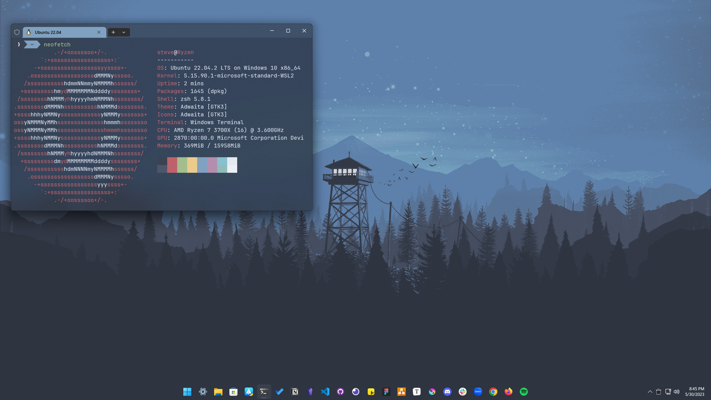
</p>

## ☑ Prerequisites

- Windows 10 version 2004 and higher (Build 19041 and higher) or Windows 11 [(Which version do I have?)](https://support.microsoft.com/en-us/topic/628bec99-476a-2c13-5296-9dd081cdd808)
- A [GitHub](https://github.com) account

## 🐧 WSL

The first and most important part of setting up your Windows dev environment is installing the Windows Subsystem for Linux (WSL). I recommend sticking with Ubuntu but feel free to try out as many distributions as you like. There are no issues with having multiple distributions installed at once.

### Installing WSL 2

WSL 2 is the latest version of WSL, adding new features like a full Linux kernel and full system call compatibility. There used to be a handful of steps needed to install it, but we now only need to enter the following command into PowerShell or Command Prompt:

```sh
wsl --install
```

This command does the following:

- Enables the optional WSL and Virtual Machine Platform components
- Downloads and installs the latest Linux kernel
- Sets WSL 2 as the default
- Downloads and installs the Ubuntu Linux distribution (a reboot may be required)

Using the `--install` command defaults to Ubuntu and only works if WSL is not installed yet. If you would like to change your default Linux distribution, [follow these docs](https://docs.microsoft.com/en-us/windows/wsl/install#change-the-default-Linux-distribution-installed).

### User Config

Once the process of installing your Linux distribution with WSL is complete, open the distribution (Ubuntu by default) using the Start menu. You will be asked to create a User Name and Password for your Linux distribution. When you enter your new password, nothing will display in the terminal. Your keyboard is still working! It is just a security feature.

- This User Name and Password is specific to each separate Linux distribution that you install and has no bearing on your Windows user name.

- Once you create a User Name and Password, the account will be your default user for the distribution and automatically sign in on launch.

- This account will be considered the Linux administrator, with the ability to run sudo (Super User Do) administrative commands.

- Each Linux distribution running on WSL has its own Linux user accounts and passwords. You will have to configure a Linux user account every time you add a distribution, reinstall, or reset.

### Updating Linux

It is recommended that you regularly update and upgrade your packages. In Ubuntu or Debian, we use the `apt` package manager:

```sh
sudo apt update && sudo apt upgrade
```

Windows does not automatically update or upgrade your Linux distribution(s). This is a task that most Linux users prefer to control themselves.

### Mapping Your Linux Drive

When you open the Windows file explorer, it displays your devices and drives. We are going to add our Ubuntu virtual drive as a network location for easy access.

1. Open the `\\wsl$\` location from file explorer:

<p align="center">

</p>

2. Right-click on the Ubuntu folder, and select `Map network drive`:

<p align="center">

</p>

3. Select the drive letter you would like to use, leave `Reconnect at sign-in` checked and `Connect using different credentials` unchecked, and then click finish (mine will look slightly different because it's already been done):

<p align="center">

</p>

4. The result should look something like this:

<p align="center">

</p>

If you wanted to access your Windows files from the Linux terminal, they are found in the `/mnt/` directory, so your Windows user directory would be located at `/mnt/c/Users/username`.

With your Ubuntu drive mapped, you can easily drag/drop or copy/paste Windows files to the Linux file system by using the file explorer.

However, it is recommended to store your project files on the Linux file system. It will be much faster than accessing files from Windows and it can also be a little buggy.

#### Pin Your Code Directory

Another quick tip I have is to create a code directory inside of Ubuntu, and then pin it to the quick access menu found on the left side of the file explorer. This comes in handy when transferring files quickly between Windows and Linux.

1. Open File Explorer and click on the Ubuntu network drive we created
2. Select the home dir, and then your user directory
3. Right-click and create a new folder, name it code, or anything else you'd like
4. Drag that new folder to the left, underneath the star icon that says `Quick access`

<p align="center">

</p>

### Restarting WSL

If for some reason WSL stops working, you can restart it with these two commands from PowerShell/Command Prompt:

```sh
wsl.exe --shutdown
wsl.exe
```

If you return to your Linux shell everything should be normal.

## 👨‍💻 Windows Terminal

To launch a Linux terminal we currently need to use the Ubuntu icon from the Start menu or enter the `wsl` or `bash` commands into PowerShell/Command Prompt. Another option that will give us more features like tabs, split views, themes, transparency, and key bindings, is to use the Windows Terminal. There are also a few other terminals like [Cmder](https://cmder.net/), [ConEmu](https://conemu.github.io/), or [Hyper](https://hyper.is/), but in my experience, Windows Terminal works extremely well.

### Installing Windows Terminal

Windows 11 comes with Windows Terminal by default, but If you are using Windows 10, Download and install Windows Terminal through the [Microsoft Store](https://www.microsoft.com/en-us/p/windows-terminal/9n0dx20hk701?rtc=1&activetab=pivot:overviewtab).

### Terminal Settings

A few quick things I recommend setting up are the default profile and your starting home directory. These settings make it so launching Windows Terminal will open directly into WSL inside our user's home directory.

#### Default Profile

Windows Terminal will open a PowerShell or Command Prompt shell when launched by default, here is how to switch it to WSL:

1. Select the `˅` icon from Windows Terminal and go to the Settings menu:

<p align="center">

</p>

2. In the Startup section you will find the Default profile dropdown, select Ubuntu. Below it, select Windows Terminal as the Default terminal application:

<p align="center">

</p>

#### Starting Directory

A default Ubuntu terminal will open to the root directory. To make finding your files a little quicker we can have it open into your home directory instead.

1. Under the Profiles section in the settings menu click on Ubuntu
2. At the General tab, you will find a Starting directory input
3. Enter the following replacing "username" with your Ubuntu user name: `\home\username`
4. You can leave the `Use parent process directory` box unchecked

<p align="center">

</p>

There are many more settings to explore, and there is also a JSON file you can edit for more advanced customizations.

Check out [this guide](https://www.ubuntupit.com/best-windows-terminal-themes-and-color-schemes/) for some popular Windows Terminal themes and how to install them.

## 📝 Git Config

Git should come pre-installed on most, if not all of the WSL Linux distributions. To ensure you have the latest version, use the following command in an Ubuntu or Debian-based distro:

```sh
sudo apt install git
```

### Name

To set up your Git config file, open a WSL command line and set your name with this command (replacing "Your Name" with your preferred username):

```sh
git config --global user.name "Your Name"
```

### Email

Set your email with this command (replacing "youremail@domain.com" with the email you prefer):

```sh
git config --global user.email "youremail@domain.com"
```

### Username

And finally, add your GitHub username to link it to git (case sensitive!):

```sh
git config --global user.username "GitHub username"
```

Make sure you are inputting `user.username` and not `user.name` otherwise, you will overwrite your name and you will not be correctly synced to your GitHub account.

You can double-check any of your settings by typing `git config --global user.name` and so on. To make any changes just type the necessary command again as in the examples above.

## GitHub CLI Installation

Download binaries from the official source:

```sh
(type -p wget >/dev/null || (sudo apt update && sudo apt-get install wget -y)) \
	&& sudo mkdir -p -m 755 /etc/apt/keyrings \
	&& wget -qO- https://cli.github.com/packages/githubcli-archive-keyring.gpg | sudo tee /etc/apt/keyrings/githubcli-archive-keyring.gpg > /dev/null \
	&& sudo chmod go+r /etc/apt/keyrings/githubcli-archive-keyring.gpg \
	&& echo "deb [arch=$(dpkg --print-architecture) signed-by=/etc/apt/keyrings/githubcli-archive-keyring.gpg] https://cli.github.com/packages stable main" | sudo tee /etc/apt/sources.list.d/github-cli.list > /dev/null \
	&& sudo apt update \
	&& sudo apt install gh -y
```

Once the CLI is installed, run this command to update:

```sh
sudo apt update && sudo apt install gh
```

## GitHub CLI Configuration

Enter this command in the terminal:

```sh
gh auth login
```

Follow the prompts to authenticate your GitHub account. 

### Creating your Personal Access Token

GitHub has removed the ability to use a conventional password when working in a remote repository. You are now required to create a personal access token instead.

>Personal access tokens (PATs) are an alternative to using passwords for authentication to GitHub when using the [GitHub API](https://docs.github.com/en/rest/overview/other-authentication-methods#via-oauth-and-personal-access-tokens) or the [command line](https://docs.github.com/en/authentication/keeping-your-account-and-data-secure/creating-a-personal-access-token#using-a-token-on-the-command-line).

Follow [these docs](https://docs.github.com/en/authentication/keeping-your-account-and-data-secure/creating-a-personal-access-token) for step-by-step instructions on creating your personal token.

### Git Credential Manager

Once you enter your token the first time, it can be stored via [Git Credential Manager (GCM)](https://github.com/GitCredentialManager/git-credential-manager) so you won't have to authenticate yourself each time.

You can have Git installed in WSL and also in Windows at the same time. [Git for Windows](https://gitforwindows.org/) includes GCM.

<p align="center">

</p>

You can also download the [latest installer for Windows](https://github.com/GitCredentialManager/git-credential-manager/releases/latest) to install the GCM standalone version.

### Storing Your Token

Once Git Credential Manager is installed you can set it up for use with WSL. Open your WSL terminal and enter this command:

```sh
git config --global credential.helper "/mnt/c/Program\ Files/Git/mingw64/libexec/git-core/git-credential-manager-core.exe"
```

Note:

If you ever receive the following error message:

```sh
/mnt/c/Program\ Files/Git/mingw64/libexec/git-core/git-credential-manager-core.exe store: 1:
/mnt/c/Program Files/Git/mingw64/libexec/git-core/git-credential-manager-core.exe: not found
```

Try using this command:

```sh
git config --global credential.helper store
```

## 💤 Zsh

 Z shell works almost identically to the standard BASH shell found on default Linux installs. What makes it different is its support for plugins and themes, along with some extra features like spelling correction and recursive path expansion. It's time to throw BASH in the trash!

### Installing Zsh

Zsh can be installed with one command:

```sh
sudo apt install zsh
```

After installing, type the `zsh` command. Zsh will ask you to choose some configurations. We will do this later on while installing oh-my-zsh, so choose option `0` to create the config file and prevent this message from showing again.

### OhMyZsh

The most popular plugin framework by far is [OhMyZsh](https://ohmyz.sh/). It comes preloaded with loads of plugins, themes, helpers, and more. It can help with productivity for sure, but more importantly, it just looks cool 😎.

### cURL

First off, we need to make sure we have [cURL](https://curl.se/) installed. Short for "Client URL", it's a way to transfer data from the command line, and that's how we will download OhMyZsh.

```sh
sudo apt install curl
```

### Installing OhMyZsh

Enter the following command into your terminal to install OhMyZsh:

```sh
sh -c "$(curl -fsSL https://raw.github.com/ohmyzsh/ohmyzsh/master/tools/install.sh)"
```

That's it! You should now see a `.oh-my-zsh` directory inside of your home directory. To change your plugins and themes you will need to edit your `.zshrc` file, also found in your home dir.

Here is a list of all the [themes](https://github.com/ohmyzsh/ohmyzsh/wiki/Themes) and [plugins](https://github.com/ohmyzsh/ohmyzsh/wiki/Plugins) that come bundled with OhMyZsh.

### More Plugins

There are countless plugins available, but these are the two I recommend most.

#### [zsh-autosuggestions](https://github.com/zsh-users/zsh-autosuggestions)

Autosuggestions for zsh, It suggests commands as you type based on history and completions.

1. Clone this repository into `$ZSH_CUSTOM/plugins` (by default `~/.oh-my-zsh/custom/plugins`)

```sh
git clone https://github.com/zsh-users/zsh-autosuggestions ${ZSH_CUSTOM:-~/.oh-my-zsh/custom}/plugins/zsh-autosuggestions
```

2. Add the plugin to the list of plugins for Oh My Zsh to load (inside `~/.zshrc`):

```sh
plugins=(git zsh-autosuggestions)
```

3. Start a new terminal session.

#### [zsh-syntax-highlighting](https://github.com/zsh-users/zsh-syntax-highlighting)

This package provides syntax highlighting for the shell zsh. It enables the highlighting of commands whilst they are typed at a zsh prompt into an interactive terminal. This helps in reviewing commands before running them, particularly in catching syntax errors.

1. Clone this repository in oh-my-zsh's plugins directory:

```sh
git clone https://github.com/zsh-users/zsh-syntax-highlighting.git ${ZSH_CUSTOM:-~/.oh-my-zsh/custom}/plugins/zsh-syntax-highlighting
```

2. Activate the plugin in `~/.zshrc`:

```sh
plugins=(git zsh-autosuggestions zsh-syntax-highlighting)
```

3. Start a new terminal session.

A huge list of plugins can be found at the [awesome zsh plugins repo](https://github.com/unixorn/awesome-zsh-plugins).

## 📦 Node.js

Node.js is a JavaScript runtime environment that executes JavaScript code outside a web browser. It allows us to install packages, run local web servers, create APIs, and more.

### NVM

You will likely need to switch between multiple versions of Node.js based on the needs of the different projects you're working on. Node Version Manager allows you to quickly install and use different versions of Node via the command line.

#### Installing and Updating NVM

1. Open your terminal and install NVM with `curl` or `wget`:

```sh
curl -o- https://raw.githubusercontent.com/nvm-sh/nvm/v0.40.1/install.sh | bash
```

```sh
wget -qO- https://raw.githubusercontent.com/nvm-sh/nvm/v0.40.1/install.sh | bash
```

To verify installation, enter:

```sh
command -v nvm
```

This should return 'nvm', if you receive 'command not found' or no response at all, close your current terminal, reopen it, and try again.

2. List which versions of Node are currently installed (should be none at this point):

```sh
nvm ls
```

This will show Node is not currently installed, and lists all versions available for install.

1. Install both the current and stable LTS versions of Node.js.

Install the current stable LTS release of Node.js (recommended for production applications):

```sh
nvm install --lts
```

Install the current release of Node.js (for testing the latest Node.js features and improvements, but more likely to have issues):

```sh
nvm install node
```

4. List what versions of Node are installed:

```sh
nvm ls
```

Now you should see the two versions that you just installed listed.

<p align="center">

</p>

5. Verify that Node.js is installed and the current version:

```sh
node -v
```

Then verify that you have NPM installed as well:

```sh
npm --version
```

#### Changing Node Versions

Use the following commands to change the version of Node you would like to use for any given project:

_Switch to the LTS version:_

```sh
nvm use --lts
```

You can also use the specific number for any additional versions you've installed:

```sh
nvm use v23.1.0
```

To list all of the versions of Node.js available, use the command: `nvm ls-remote`.

### NPM

Node Package Manager is the default package manager for Node.js. It is a command-line tool used to download or publish packages and manage the dependencies of a project. There is a searchable repository of all available NPM packages at [https://www.npmjs.com/](https://www.npmjs.com/).

To list your current installed version of NPM:

```sh
npm -v
```

#### New Projects

When creating a new project that will utilize NPM, it must be initialized with the `init` command. First, make sure you are in the root directory of your project, and then use the following command:

```sh
npm init
```

#### package.json

`npm init` generates a `package.json` file and will prompt you for the metadata of your project. This includes things like the name, version, description, and license. You can think of it as the blueprint of your project as it will also contain the packages it depends on. The metadata can be changed at any time by editing the `package.json` file after the initialization.

If you would like to automatically populate the initialization with all the default values, you may add the `--yes` flag.

```sh
npm init --yes
```

#### Installing Modules

Modules are installed via the `npm install` or `npm i` command.

```sh
npm install react
```

The above command will install the React module as a dependency in `package.json`.

We can also install NPM packages globally on our system. This is useful for utilities like command line interfaces.

[Yarn](https://yarnpkg.com/) is another widely used node package manager, if we wanted to use it on all our node projects we would need the `--global` or `-g` flag.

```sh
npm install --global yarn
```

#### Dependencies

You can save a module as either a dependency or a developer dependency.

A dependency would be something that your project cannot function properly without.

The `--save` flag used to be needed to install modules as a dependency, but it is now done automatically with the `install` command.

```sh
npm install --save gray-matter
```

Is the same as:

```sh
npm install gray-matter
```

<p align="center">

</p>

#### Developer Dependencies

A developer dependency would be the modules used to build the project, not run it. This would include things like linters and testing tools.

Developer dependencies are added with the `--save-dev` or `-D` flag. This adds the module to the `devDependencies` section of `package.json`

```sh
npm install --save-dev husky
```

<p align="center">

</p>

#### Batch Installing

Apart from installing a single module, you can install all modules that are listed as `dependencies` and `devDependencies`:

```sh
npm install
```

This will install all modules listed in the `package.json` of your current directory.

If we only wanted to install the dependencies needed to run our project, the `--production` flag is used:

```sh
npm install --production
```

the `--production` flag will only install the modules from the `dependencies` section of `package.json` and ignore the `devDependencies`. The perk of this is notably reducing the size of the `node_modules` folder.

#### Uninstalling

Removing modules works in the same way as installing them. Flags will need to be used for any global or developer dependencies.

_Dependencies:_

```sh
npm uninstall react
```

_Developer Dependencies:_

```sh
npm uninstall --save-dev husky
```

_Global Installs:_

```sh
npm uninstall --global yarn
```

#### Versioning

Package versions are identified with major, minor, and patch releases. `8.1.1` would be major version 8, minor version 1, and patch version 1.

You can specify an exact version number by using the `@` symbol.

```sh
npm install react@17.0.1
```

Two more symbols we can use are `^` and `~`.

`^` is the latest minor release.
For example, `npm install ^8.1.1` specification might install version `8.3.1` if that's the latest minor version.

`~` is the latest patch release.
In the same way as minor releases, `npm install ~8.1.1` could install version `8.1.6` if that's the latest patch version available.

When using the `npm install` or `npm i` command, the latest minor version will be used.

#### package-lock.json

The exact package versions will be documented in a generated `package-lock.json` file.

The values found inside the `dependencies` and `devDependencies` objects of the `package.json` file include a range of acceptable versions of each package to install.

`package-lock.json` is generated by the `npm install` command and contains the _exact_ versions of the dependencies used.

#### Scripts

`package.json` also contains a `scripts` property that can be defined to run command-line tools installed on the current project. This can include things like running tests, formatting your code, and launching a local server.

<p align="center">

</p>

NPM scripts are run by using the `run` command. With the above configuration, you would use the following command to have prettier format your code:

```sh
npm run format
```

The keys in the scripts object are the command names and the values are the actual commands.

_Check out the official [NPM](https://docs.npmjs.com/), [NVM](https://github.com/nvm-sh/nvm), and [Node.js](https://nodejs.org/en/docs/) docs for more in-depth guides._

## 💻 Visual Studio Code

There are many amazing code editors available for free, but Visual Studio Code our favorite and recommended by VetsWhoCode.

### Installing VS Code

VS Code is available on Windows, macOS, and Linux. You can download the latest Windows installer [here](https://code.visualstudio.com/download).

During installation, be sure to select the **Add to PATH** option, allowing you to open a folder in WSL from the Windows terminal.

### Remote Extension

Install the [Remote Development Extension Pack](https://marketplace.visualstudio.com/items?itemName=ms-vscode-remote.vscode-remote-extensionpack).

>This allows you to use WSL as your integrated development environment and will handle compatibility and pathing for you. [Learn more](https://code.visualstudio.com/docs/remote/remote-overview).

This extension will also allow you to launch VS Code right from your WSL terminal by using the `code` command.

If I were inside the root directory of my repository, I would use `code .` to launch the entire directory inside VS Code.

```sh
cd my-project
code .
```

### Changing the Default Shell

The WSL2 shell can be chosen as the default VS Code terminal by pressing <kbd>Ctrl</kbd> + <kbd>Shift</kbd> + <kbd>P</kbd> and typing/choosing Terminal: Select Default Profile, then selecting zsh:

<p align="center">

</p>

<p align="center">

</p>

### Install the Vets Who Code Extension Pack

[VetsWhoCode Extension Pack](https://marketplace.visualstudio.com/items?itemName=VetsWhoCode.vetswhocode-extension-pack) - Extension Pack for new veterans learning javascript at #VetsWhoCode

### Install the Vets Who Code Theme for VS Code

[HashFlag Theme](https://marketplace.visualstudio.com/items?itemName=OfficialVetsWhoCode.HashFlag) - A High contrast programming theme inspired by the colors of Vets Who Code.

### More Extensions

The number of extensions available for VS Code can be overwhelming, here are some useful extenstions:

- [Auto Close Tag](https://marketplace.visualstudio.com/items?itemName=formulahendry.auto-close-tag) - Automatically add HTML/XML close tag.
- [Auto Rename Tag](https://marketplace.visualstudio.com/items?itemName=formulahendry.auto-rename-tag) - Automatically rename paired HTML/XML tag.
- [Color Highlight](https://marketplace.visualstudio.com/items?itemName=naumovs.color-highlight) - This extension styles CSS/web colors found in your document.
- [Dash](https://marketplace.visualstudio.com/items?itemName=deerawan.vscode-dash) - Dash, Zeal, and Velocity integration in Visual Studio Code
- [Docker](https://marketplace.visualstudio.com/items?itemName=ms-azuretools.vscode-docker) - This makes it easy to create, manage, and debug containerized applications.
- [Draw.io Integration](https://marketplace.visualstudio.com/items?itemName=hediet.vscode-drawio) - This unofficial extension integrates Draw.io (also known as diagrams.net) into VS Code.
- [ESLint](https://marketplace.visualstudio.com/items?itemName=dbaeumer.vscode-eslint) - Find and fix problems in your JavaScript code
- [Git History](https://marketplace.visualstudio.com/items?itemName=donjayamanne.githistory) - View git log, file history, compare branches or commits
- [GitHub Markdown Preview](https://marketplace.visualstudio.com/items?itemName=bierner.github-markdown-preview) - Adds styling, markdown checkboxes, footnotes, emoji, and YAML preamble.
- [GitLens](https://marketplace.visualstudio.com/items?itemName=eamodio.gitlens) - Quickly glimpse into whom, why, and when a line or code block was changed.
- [Live Server](https://marketplace.visualstudio.com/items?itemName=ritwickdey.LiveServer) - Launch a local development server with a live reload feature for static & dynamic pages.
- [Live Share](https://marketplace.visualstudio.com/items?itemName=MS-vsliveshare.vsliveshare-pack) - Includes everything you need to start collaboratively editing and debugging in real-time.
- [Markdown All in One](https://marketplace.visualstudio.com/items?itemName=yzhang.markdown-all-in-one) - Markdown keyboard shortcuts, table of contents, auto preview, and more
- [markdownlint](https://marketplace.visualstudio.com/items?itemName=DavidAnson.vscode-markdownlint) - Markdown linting and style checking for Visual Studio Code
- [Postman](https://marketplace.visualstudio.com/items?itemName=Postman.postman-for-vscode) - Streamline API development and testing with the power of Postman, directly in your favorite IDE.
- [Prettier](https://marketplace.visualstudio.com/items?itemName=esbenp.prettier-vscode) - Prettier is an opinionated code formatter.
- [Wakatime](https://marketplace.visualstudio.com/items?itemName=WakaTime.vscode-wakatime) - Metrics, insights, and time tracking automatically generated from your programming activity.

Note:
>You will need to install any VS Code extensions for your Remote - WSL. Extensions already installed locally on VS Code will not automatically be available. [Learn more](https://code.visualstudio.com/docs/remote/wsl#_managing-extensions).

## 🍫 Chocolatey

[Chocolatey](https://community.chocolatey.org/) is a command-line package manager like [homebrew](https://brew.sh/) or [APT](https://ubuntu.com/server/docs/package-management), but for Windows.

### Admin Shell

Before we start the installation process, I want to cover launching an administrative shell from Windows. There are a few ways to do this:

#### Option 1

Right-click on the Windows start menu and select Windows Terminal (Admin):

<p align="center">

</p>

Once your terminal loads, click the `˅` icon and open a new PowerShell tab. It should say `Administrator: Windows PowerShell` in the new tab:

<p align="center">

</p>

#### Option 2

If you have Windows Terminal on your taskbar, <kbd>Shift</kbd> + <kbd>Right-Click</kbd> on the icon select run as administrator, and then open a new PowerShell tab:

<p align="center">

</p>

#### Option 3

Use the search bar from the Start menu and type in `powershell`. A link to Run as Administrator will display:

<p align="center">

</p>

#### Option 4

Windows Terminal added a new feature where you can launch a PowerShell/Command Prompt profile in an Admin terminal automatically. In the Windows Terminal settings, scroll down to your desired profile and then toggle the `Run this profile as Administrator` switch. Now you can skip all the steps above, and the terminal will always launch as admin.

<p align="center">

</p>

### Installing Chocolatey

1. Open an administrative PowerShell terminal

2. Run the following command:

```ps
Get-ExecutionPolicy
```

3. If it returns `Restricted`, then run one of the following commands:

```ps
Set-ExecutionPolicy AllSigned
```

or

```ps
Set-ExecutionPolicy Bypass -Scope Process
```

>With PowerShell, you must ensure `Get-ExecutionPolicy` is not Restricted. We suggest using `Bypass` to bypass the policy to get things installed or `AllSigned` for quite a bit more security.

4. Finally, run the following command:

```ps
Set-ExecutionPolicy Bypass -Scope Process -Force; [System.Net.ServicePointManager]::SecurityProtocol = [System.Net.ServicePointManager]::SecurityProtocol -bor 3072; iex ((New-Object System.Net.WebClient).DownloadString('https://community.chocolatey.org/install.ps1'))
```

If you don't see any errors, you are ready to use Chocolatey! Type `choco` or `choco -?` now, or see [Getting Started](https://docs.chocolatey.org/en-us/getting-started) for usage instructions.

### Basic Chocolatey Commands

We use the `choco` command to run Chocolatey. (_Remember, you must use an administrative shell for it to work._)

Install a new package:

```ps
choco install filename
```

Remove a package:

```ps
choco uninstall filename
```

List all of the installed packages:

```ps
choco list
```

Update:

```ps
choco upgrade filename
```

or to update everything at once:

```ps
choco upgrade all
```

### Windows Apps

Search for available apps on the [Community Package Repository](https://community.chocolatey.org/packages).

Here are a few of my favorite (free) apps for productivity and development on Windows:

- [Wox](http://www.wox.one/) - A full-featured launcher
- [RunJs](https://runjs.app/) - JavaScript and TypeScript playground
- [Responsively](https://responsively.app) - A modified web browser that helps in responsive web development.
- [Zeal](https://zealdocs.org/) - the Windows version of Dash
- [Figma](https://www.figma.com) - A collaborative UI design tool
- [draw.io](https://app.diagrams.net) - Flowchart maker and diagram software
- [GitHub Desktop](https://desktop.github.com/) - A GUI for Git
- [Postman](https://www.postman.com/) - API tools
- [Notion](https://www.notion.so/) - Project management and note-taking software
- [Obsidian](https://obsidian.md/) - A note-taking app using markdown
- [Microsoft PowerToys](https://docs.microsoft.com/en-us/windows/powertoys/?WT.mc_id=twitter-0000-docsmsft) - A set of utilities for power users

You can download all these at once with the following command using Chocolatey in an admin shell:

```ps
choco install wox runjs responsively zeal figma drawio github-desktop postman notion powertoys obsidian -y
```

## 🪜 Chrome Extensions

These are all available as [Firefox extensions](https://addons.mozilla.org/en-US/firefox/extensions/) as well.

- [Axe Accessibility](https://chrome.google.com/webstore/detail/axe-devtools-web-accessib/lhdoppojpmngadmnindnejefpokejbdd) - Accessibility Checker for Developers, Testers, and Designers in Chrome
- [ColorZilla](https://chrome.google.com/webstore/detail/colorzilla/bhlhnicpbhignbdhedgjhgdocnmhomnp) - Advanced Eyedropper, Color Picker, Gradient Generator, and other colorful goodies
- [daily.dev](https://chrome.google.com/webstore/detail/dailydev-the-homepage-dev/jlmpjdjjbgclbocgajdjefcidcncaied) - Get a feed of the hottest developer news personalized to you.
- [JSON Formatter](https://chrome.google.com/webstore/detail/json-formatter/bcjindcccaagfpapjjmafapmmgkkhgoa?hl=en) - Makes JSON easy to read.
- [Nimbus Capture](https://chrome.google.com/webstore/detail/nimbus-screenshot-screen/bpconcjcammlapcogcnnelfmaeghhagj) - Screen Capture full Web page or any part.
- [React Dev tools](https://chrome.google.com/webstore/detail/react-developer-tools/fmkadmapgofadopljbjfkapdkoienihi) - Adds React debugging tools to the Chrome Developer Tools.
- [Site Pallette](https://chromewebstore.google.com/detail/site-palette/pekhihjiehdafocefoimckjpbkegknoh?hl=en-US&utm_source=ext_sidebar) - Generate a color palette from any website.
- [WhatFont](https://chrome.google.com/webstore/detail/whatfont/jabopobgcpjmedljpbcaablpmlmfcogm) - With this extension, you could inspect web fonts by just hovering on them.

## 🇺🇸 VetsWhoCode Web App

Let's get the VWC App installed and running locally. It will be our first step toward making Open-Source contributions to the organization!

1. Clone the Repo

Clone the repository from GitHub:

```sh
gh repo clone Vets-Who-Code/vets-who-code-app
```

<p align="center">

</p>

This may take a few minutes.

2. Change Directory

Change into the newly cloned directory:

```sh
cd vets-who-code-app
```

<p align="center">
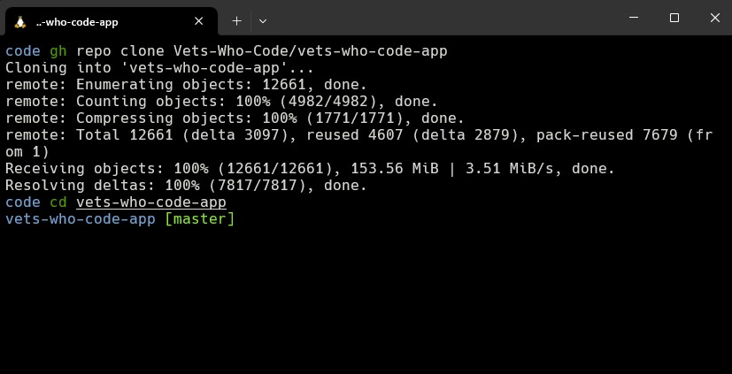
</p>

3. Install Node.js

Using `nvm install` will install the version of Node.js required by the VWC app:

```sh
nvm install
```

<p align="center">

</p>

4. Install Dependencies

`npm install` is how we install React, Next, Bootstrap, and every other piece of tech that the app requires. This will also take a few minutes.

```sh
npm install
```

There will be **a lot** of warnings and other messages that display, but this is normal.

<p align="center">
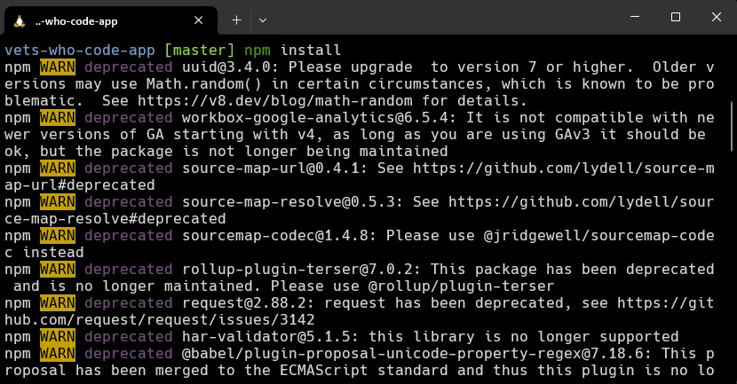
</p>

<p align="center">
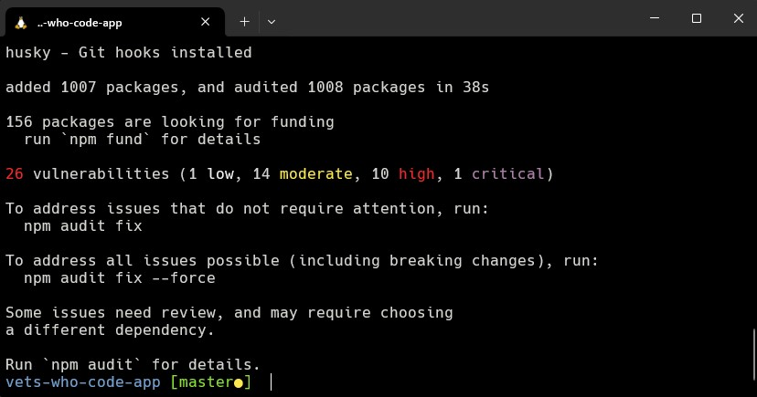
</p>


5. Run the App

Finally, we can launch the app on our local server:

```sh
npm run dev
```

<p align="center">

</p>

You should be able to view the website locally at [http://localhost:3000/](http://localhost:3000/)].

<kbd>CTRL</kbd> + <kbd>Left-click</kbd> on the localhost link in your terminal to launch the app in your browser.

<kbd>CTRL</kbd> + <kbd>C</kbd> to close the dev server when you are finished.

## 🐍 Python

This section covers setting up a Python development environment in WSL. In the end, you will have a package manager, environment manager, some frameworks, extensions, and more.

The first step will be confirming that Python is already installed on your system:

```sh
python3 --version
```

A Python version number should be returned. If not, install it with:

```sh
sudo apt install python3
```

### pip

pip is the package manager for Python, similar to npm for JavaScript. Install it using the following:

```sh
sudo apt install python3-pip
```

### venv

venv allows you to create virtual environments for your Python projects, helping to prevent versioning conflicts.

```sh
sudo apt install python3-venv
```

### Flask

Flask is a web development framework similar to Express for Node.js. It can be installed by using pip:

```sh
pip3 install flask
```

### Django

Another popular web development framework is Django. Just as before, install it using pip:

```sh
pip3 install django
```

### JupyterLab

JupyterLab is a web-based interactive development environment. It is a powerful tool used in data science, scientific computing, computational journalism, and machine learning. Install it using the following command:

```sh
pip3 install jupyterlab
```

JupyterLab can be launched using the `jupyter-lab` command.

#### Notebook

The next step is to install the Jupyter Notebook. It allows you to create and share documents from Jupyter.

```sh
pip3 install notebook
```

The notebook is run by using the `jupyter notebook` command.

#### Voilà

Voilà allows you to convert a Jupyter Notebook into an interactive dashboard that allows you to share your work with others.

```sh
pip3 install voila
```

Launch Voilà using the `voila` command.

### Python VS Code Extensions

You will find a ton of Python extensions for VS Code, but here are a few of the more popular ones:

- [Python](https://marketplace.visualstudio.com/items?itemName=ms-python.python) - The official Python extension.
- [Django](https://marketplace.visualstudio.com/items?itemName=batisteo.vscode-django) - Syntax highlighting and snippets for Django.
- [Python Indent](https://marketplace.visualstudio.com/items?itemName=KevinRose.vsc-python-indent) - Correct Python indentation.
- [Python Environment Manager](https://marketplace.visualstudio.com/items?itemName=donjayamanne.python-environment-manager) - Manage all of your Python environments & packages.
- [autoDocstring](https://marketplace.visualstudio.com/items?itemName=njpwerner.autodocstring) - Quickly generate docstrings for Python functions.
- [Black Formatter](https://marketplace.visualstudio.com/items?itemName=ms-python.black-formatter) - Code formatter for Python using Black
- [AREPL](https://marketplace.visualstudio.com/items?itemName=almenon.arepl) - Automatically evaluates Python code in real-time as you type.
- [Python Test Explorer](https://marketplace.visualstudio.com/items?itemName=LittleFoxTeam.vscode-python-test-adapter) - Run your Python tests in the Sidebar of Visual Studio Code.

### PyCharm

Instead of using VS Code, another option is to use an IDE made specifically for Python development. JetBrains created one of the best and most widely used ones called PyCharm. There is a free community edition version that can be downloaded [here](https://www.jetbrains.com/pycharm/).

## 💎 Ruby

In this section, we'll install Ruby using `rbenv`. Using rbenv will also allow you to install multiple Ruby environments on your machine, using different versions.

_This guide continues installation with zsh as the default shell._

1. Install rbenv

```sh
sudo apt install rbenv
```

2. Follow the instructions to load rbenv in the shell:

```sh
rbenv init
```

The output will prompt you with instructions for loading rbenv. In your **.zshrc**, add the following line:

```sh
# Loading rbenv automatically
eval "$(rbenv init -)"
```

3. Restart your terminal to update the shell.

4. Before installing Ruby, you'll want to ensure your build environment contains the required tools and libraries:

```sh
sudo apt-get install autoconf bison patch build-essential rustc libssl-dev libyaml-dev libreadline6-dev zlib1g-dev libgmp-dev libncurses5-dev libffi-dev libgdbm6 libgdbm-dev libdb-dev uuid-dev
```

5. Next, install `ruby-build` as a rbenv plugin, to make sure we don't have any problems with rbenv.

```sh
git clone https://github.com/rbenv/ruby-build.git "$(rbenv root)"/plugins/ruby-build
```

6. Let's get Ruby installed:

Run this command to see which stable versions of Ruby are available:

```sh
rbenv install -l
```

Install the most recent stable version, which in this case is v3.1.2:

```sh
rbenv install --verbose 3.3.5
```

This can take a _very_ long time. The `--verbose` flag will show the install progress, otherwise, it will look like it's frozen.

_Ruby will be installed in your `~/.rbenv` directory._

7. Set the global version, so that when you open a new terminal, it will use this version of Ruby.

```sh
rbenv global 3.3.5
```

8. Close your terminal and open a new session. Check your current version of Ruby:

```sh
ruby -v
```

You should see something like this:

```sh
ruby 3.3.5 (2024-09-03 revision ef084cc8f4) [x86_64-linux]
```

### Rails

Now that Ruby is installed, you can install Rails. Ruby has its built-in package manager, called RubyGems. This is what you'll use to install Rails.

Enter the following to install Rails v7.2.1.2:
_The `--no-document` flag speeds up the installation by skipping the gem documentation files._

```sh
gem install rails -v 7.2.1.2 --no-document
```

1. Next you'll need to install a shim to associate the `rails` command with `rbenv`:

```sh
rbenv rehash
```

This command should run automatically after gems are installed

2. Close your terminal and open a new session. Verify Rails was successfully installed:

```sh
rails -v
```

You should see this in your terminal:

```sh
Rails 7.0.4
```

### Ruby VS Code Extensions

- [Ruby](https://marketplace.visualstudio.com/items?itemName=rebornix.Ruby) - Official VS Code Ruby extension.
- [VSCode Ruby](https://marketplace.visualstudio.com/items?itemName=wingrunr21.vscode-ruby) - Syntax highlighting, snippet, and language configuration support for Ruby.
- [Ruby Test Explorer](https://marketplace.visualstudio.com/items?itemName=connorshea.vscode-ruby-test-adapter) - Run your Ruby tests in the Sidebar of Visual Studio Code.
- [Rails](https://marketplace.visualstudio.com/items?itemName=bung87.rails) - Ruby on Rails support for Visual Studio Code.
- [Ruby Solargraph](https://marketplace.visualstudio.com/items?itemName=castwide.solargraph) - A Ruby gem that provides IntelliSense features through Microsoft's language server protocol.
- [Ruby LSP](https://marketplace.visualstudio.com/items?itemName=Shopify.ruby-lsp) - Companion VS Code extension for the Ruby LSP gem.


## Docker

This section covers setting docker desktop for Windows. In the end, you will have a docker-daemon, docker-cli, docker-compose, and more.

Docker provides the ability to package and run an application in a loosely isolated environment called a container.
- [Docker Documentation](https://docs.docker.com/get-started/overview/)

### Docker Installation

- Docker uses virtualization to run containers so there are two options to run Docker either via WSL (recommended) or Hyper-V. If you have wsl enabled docker currently by default runs on wsl.

- What should you use? [Difference Between Hyper-V and Wsl](https://superuser.com/questions/1561465/docker-on-hyper-v-vs-wsl-2)

- If you don't have wsl2 you need to enable Hyper-V [Guide](https://techcommunity.microsoft.com/t5/educator-developer-blog/step-by-step-enabling-hyper-v-for-use-on-windows-11/ba-p/3745905)

Again there are two ways you can install docker-desktop on your Windows machine:

#### Option 1

Using [Chocolatey](https://community.chocolatey.org/) CLI package manager which we installed earlier.

For installation we will need a shell with administrative privileges, we covered how to run Powershell as an administrator while installing Chocolatey.
Using any of the options open up a PowerShell.

```sh
choco install docker-desktop
```
<p align="center">
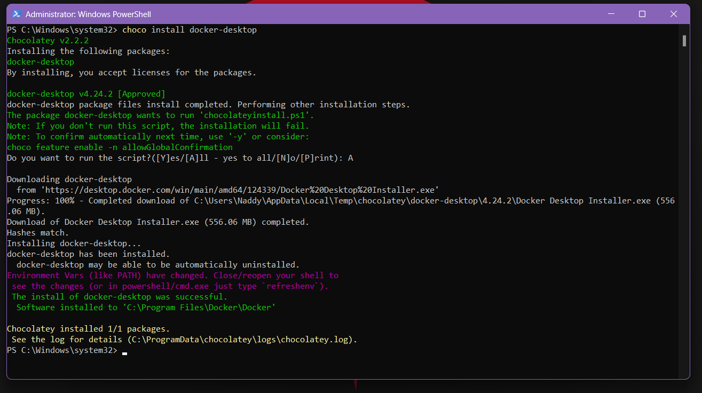
</p>

#### Option 2

Direct install via executable available on [docker.com](https://www.docker.com/products/docker-desktop/)

Step 1 - Download the executable for docker-desktop.

<p align="center">
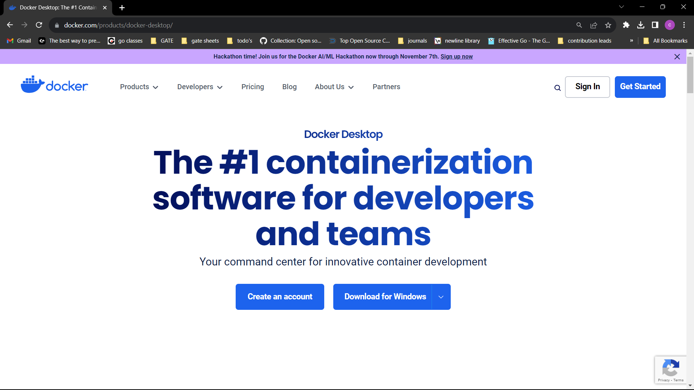
</p>

<p align="center">
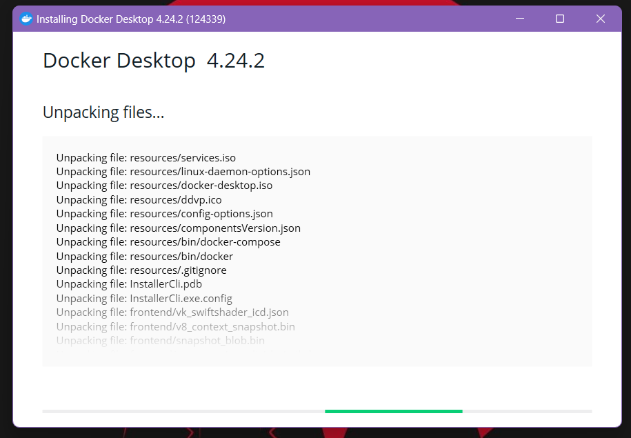
</p>

Step 2 - Install the executable, and choose the appropriate virtualization environment while installing if the option shows up.

Step 3 - Done with installation. Sign in with the docker account or skip for the time being.

<p align="center">
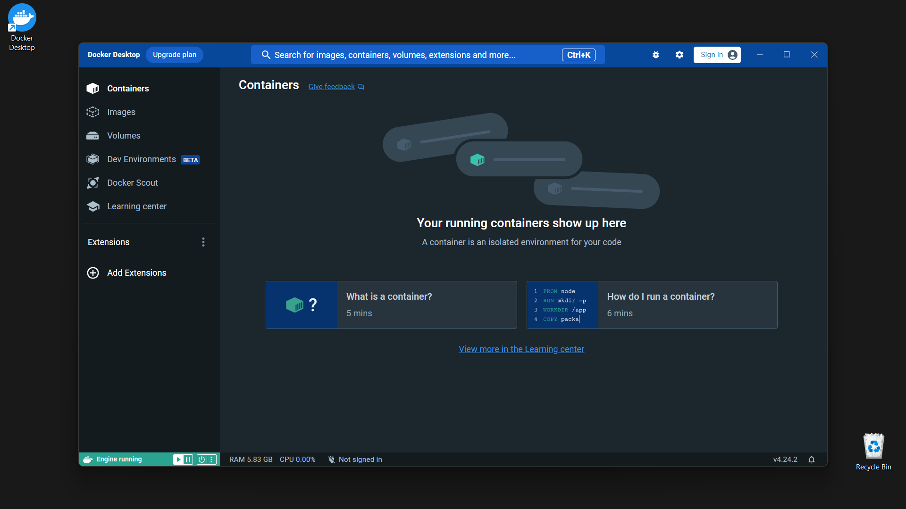
</p>

#### Test Docker CLI

Make sure you at least launch docker-desktop once, and let it run in the background.

```sh
docker -v
```
<p align="center">
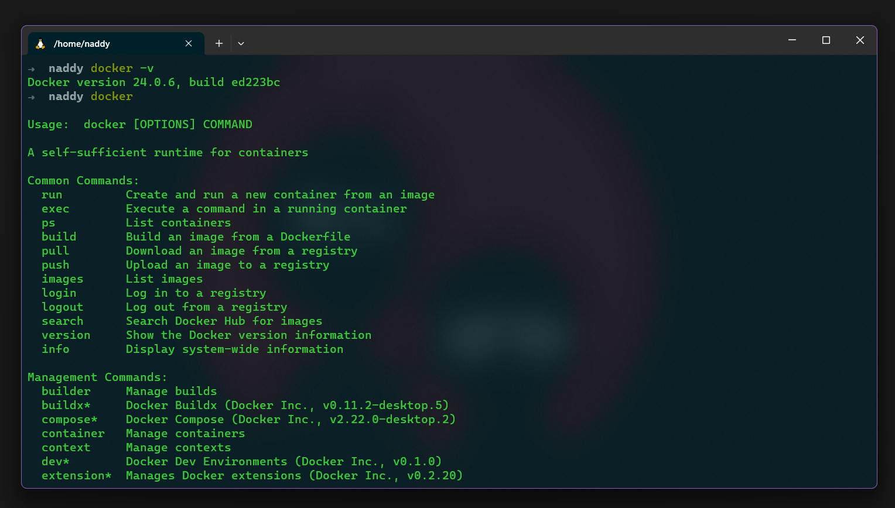
</p>

```sh
docker
```

```sh
docker info
```

<p align="center">
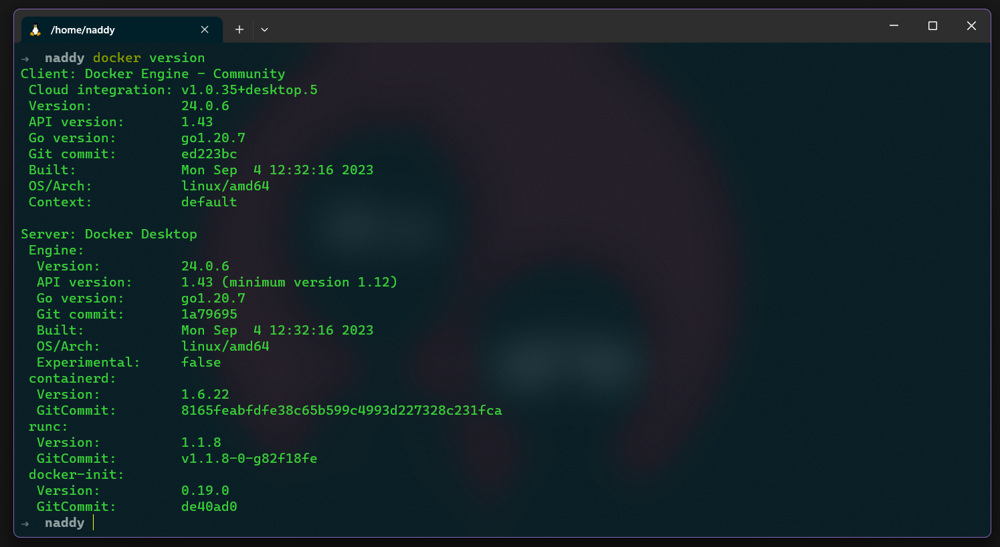
</p>

You have successfully installed docker-desktop and all other necessary tools docker-cli, docker-compose, and more.

### Docker Basics

#### Docker CLI

Let's test some of the docker functionalities using the CLI.

List all the running containers:

```sh
docker ps
```

List all the available images locally:

```sh
docker images ls -a
```

Run a container:
- p tag for specifying the port
- d tag for detaching the shell

```sh
docker run -p 8080:80 httpd
```

<p align="center">
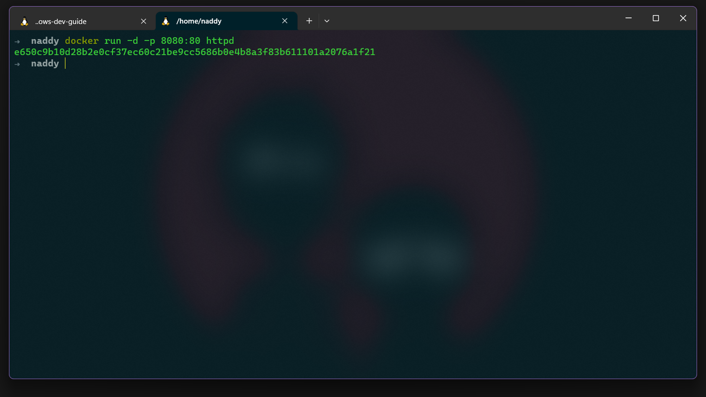
</p>

The above command will fetch a public image of httpd which is an Apache HTTP server. It then runs it as a Docker container exposing port 80, and making it available to port 8080 of our local machine. You can visit [localhost](http://localhost:8080) and view the content served by this container.

<p align="center">
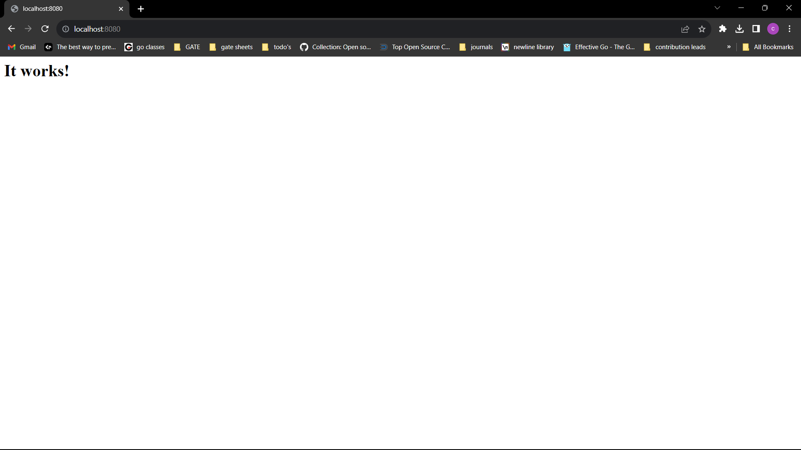
</p>

Now if you run the `ps` command again it will list out this container.

<p align="center">
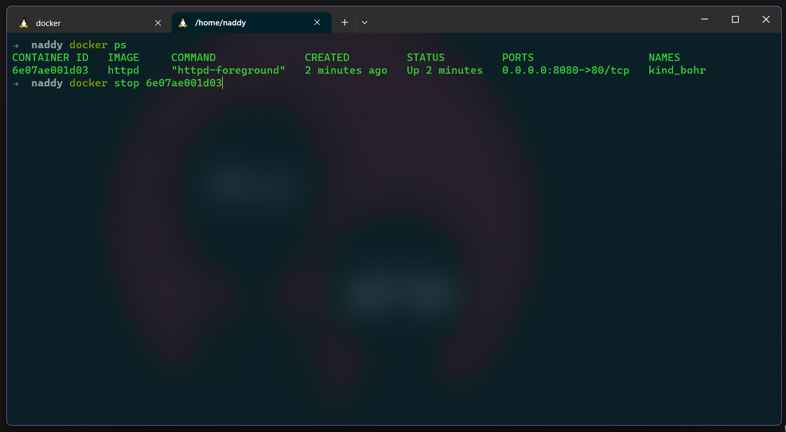
</p>

Stop the running docker container:

```sh
docker stop [container-id]
```

<p align="center">

</p>

#### Additional Docker Resources

- Explore [docker-hub](https://hub.docker.com/search?q=) library of all the public docker images.
- [What is a Container?](https://docs.docker.com/get-started/#what-is-a-container)
- [What is an Image?](https://docs.docker.com/get-started/#what-is-an-image)
- [Dockerfile](https://docs.docker.com/develop/develop-images/dockerfile_best-practices/)
- [Containerizing an application](https://docs.docker.com/get-started/02_our_app/)
- [Docker-compose](https://docs.docker.com/compose/)
- [Multi Container Application](https://docs.docker.com/get-started/07_multi_container/)
- [Image Building](https://docs.docker.com/get-started/09_image_best/)


## 📚 References

- [Set up a WSL development environment](https://docs.microsoft.com/en-us/windows/wsl/setup/environment)
- [Microsoft WSL Install Guide](https://docs.microsoft.com/en-us/windows/wsl/install)
- [WSL2 Install Guide](https://www.sitepoint.com/wsl2/)
- [Install and get started setting up Windows Terminal](https://docs.microsoft.com/en-us/windows/terminal/install)
- [Git a Grip](https://dev.to/stephanlamoureux/series/11364)
- [Git Credential Manager](https://github.com/GitCredentialManager/git-credential-manager)
- [Using Zsh in WSL](http://kevinprogramming.com/using-zsh-in-windows-terminal/)
- [Installing Node on WSL](https://docs.microsoft.com/en-us/windows/dev-environment/javascript/nodejs-on-wsl)
- [What is npm? A Node Package Manager Tutorial for Beginners](https://www.freecodecamp.org/news/what-is-npm-a-node-package-manager-tutorial-for-beginners/)
- [Chocolatey Install Docs](https://chocolatey.org/install)
