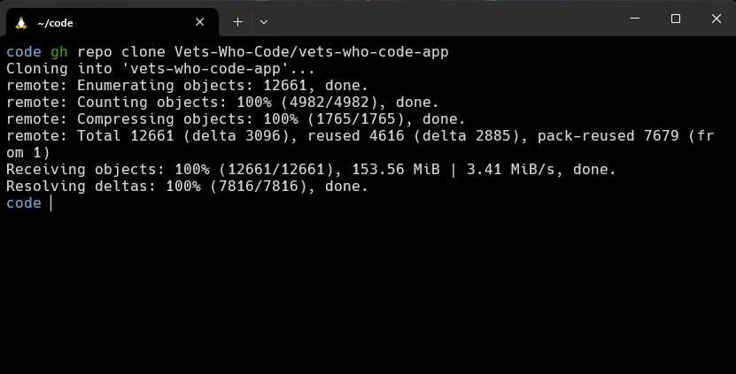
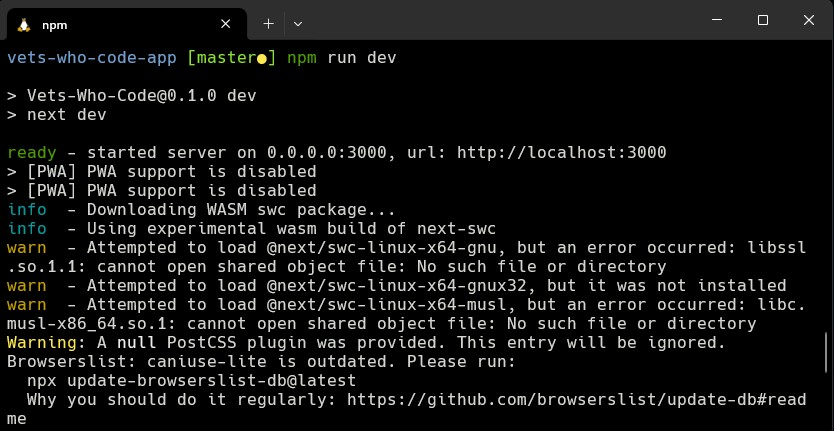

<p align="center">

</p>

<h1 align="center">Windows 开发人员设置指南（2022）</h1>

[English](./README.md) | [中文](./README_cn.md)

- [🔭概述](#概述)
- [☑先决条件](#先决条件)
- [🐧 WSL](#-wsl-1-2-3)
  - [安装 WSL 2](#安装-wsl-2)
  - [用户配置](#用户配置)
  - [更新 Linux](#更新-linux)
  - [映射你的 Linux 驱动器](#映射你的-linux-驱动器)
    - [固定代码目录](#固定代码目录)
  - [重启 WSL](#重启-wsl)
- [👨💻 Windows 终端](#-windows-终端4)
  - [安装 Windows 终端](#安装-windows-终端)
  - [终端设置](#终端设置)
    - [默认配置文件](#默认配置文件)
    - [开始目录](#开始目录)
- [📝 Git 配置](#-git-配置5)
  - [姓名](#姓名)
  - [电子邮件](#电子邮件)
  - [用户名](#用户名)
- [😺 GitHub 凭据](#-github-凭据6)
  - [创建你的个人访问令牌](#创建你的个人访问令牌)
  - [Git 凭据管理器](#git-凭据管理器)
  - [存储令牌](#存储令牌)
- [💤 Zsh](#-zsh7)
  - [安装 Zsh](#安装-zsh)
  - [OhMyZsh](#ohmyzsh)
  - [cURL](#curl)
  - [安装 OhMyZsh](#安装-ohmyzsh)
  - [更多插件](#更多插件)
    - [zsh-autosuggestions](#zsh-autosuggestions)
    - [zsh-syntax-highlighting](#zsh-syntax-highlighting)
- [📦 Node.js](#-nodejs8)
  - [NVM](#nvm)
    - [安装 NVM](#安装-nvm)
    - [更改node版本](#更改node版本)
- [💻 Visual Studio 代码](#-visual-studio-代码)
  - [安装 VS Code](#安装-vs-code)
  - [更改默认主题](#更改默认主题)
  - [远程扩展](#远程扩展)
  - [更多扩展](#更多扩展)
- [🍫Chocolatey](#Chocolatey9)
  - [管理shell](#管理shell)
    - [选项 1](#选项-1)
    - [选项 2](#选项-2)
    - [选项 3](#选项-3)
  - [安装 Chocolatey](#安装-chocolatey)
  - [基本 Chocolatey 命令](#基本-chocolatey-命令)
  - [Windows 应用程序](#windows-应用程序)
- [🪜 Chrome 扩展](#-chrome-扩展)
- [🇺🇸 VetsWhoCode Web App](#-vetswhocode-web-app)

## 🔭概述

经过大量的试验和错误，我已经能够拼凑出一个相当不错的 Windows 开发环境。已经有很多指南，但似乎没有一个涵盖整个范围。我试图在这里这样做，而不是深入任何单个主题。我相信这将为大多数用户留下流畅的 Windows 开发人员体验。

<p align="center">

</p>

## ☑先决条件

- Windows 10 版本 2004 及更高版本（Build 19041 及更高版本）或 Windows 11[（我是哪个版本？）](https://support.microsoft.com/en-us/topic/628bec99-476a-2c13-5296-9dd081cdd808)
- [GitHub](https://github.com)帐户

## 🐧 WSL [^1] [^2] [^3]

设置 Windows 开发环境的第一个也是最重要的部分是安装 WindowsLinux 子系统（WSL）。我建议坚持使用 Ubuntu，但可以随意尝试尽可能多的发行版。一次安装多个发行版没有问题。

### 安装 WSL 2

WSL 2 是 WSL 的最新版本，增加了新功能，如全 Linux 内核和全系统调用兼容性。过去安装它需要几个步骤，但我们现在只需要在 PowerShell 或命令提示符中输入以下命令：


```sh
wsl --install
```

此命令执行以下操作：

- 启用可选的 WSL 和虚拟机平台组件
- 下载并安装最新的 Linux 内核
- 将 WSL 2 设置为默认值
- 下载并安装 UbuntuLinux 发行版（可能需要重新启动）

使用 `--install` 命令默认为 Ubuntu，仅在尚未安装 WSL 时有效。如果你想更改默认 Linux 发行版，[关注这些文档](https://docs.microsoft.com/en-us/windows/wsl/install#change-the-default-Linux-distribution-installed)。

### 用户配置

使用 WSL 安装 Linux 发行版的过程完成后，使用开始菜单打开发行版（默认为 Ubuntu）。系统将要求你为 Linux 发行版创建用户名和密码。当你输入新密码时，终端中不会显示任何内容。你的键盘仍在工作！这只是一个安全功能。

- 此用户名和密码特定于你安装的每个单独的 Linux 发行版，与你的 Windows 用户名无关。

- 创建用户名和密码后，该帐户将成为分发的默认用户，并在启动时自动登录。

- 此帐户将被视为 Linux 管理员，能够运行 sudo（Super User Do）管理命令。

- WSL 上运行的每个 Linux 发行版都有自己的 Linux 用户帐户和密码。每次添加发行版、重新安装或重置时，都必须配置 Linux 用户帐户。

### 更新 Linux

建议你定期更新和升级软件包。在 Ubuntu 或 Debian 中，我们使用 `apt` 包管理器：


```sh
sudo apt update && sudo apt upgrade
```

Windows 不会自动更新或升级你的 Linux 发行版。这是大多数 Linux 用户喜欢自己控制的任务。

### 映射你的 Linux 驱动器

当你打开 Windows 文件资源管理器时，它会显示你的设备和驱动器。我们将添加我们的 Ubuntu 虚拟驱动器作为网络位置以便于访问。

1. 从文件资源管理器打开 `\\wsl$\` 位置：

<p align="center">

</p>

2. 右键单击 Ubuntu 文件夹，然后选择 `Map network drive`：

<p align="center">

</p>

3. 选择你要使用的驱动器号，保留 `Reconnect at sign-in` 选中和 `Connect using different credentials` 未选中，然后单击完成（我的看起来会略有不同，因为它已经完成）：

<p align="center">

</p>

4. 最终结果应该如下所示：

<p align="center">

</p>

如果你想从 Linux 终端访问 Windows 文件，它们可以在 `/mnt/` 目录中找到，因此你的 Windows 用户目录将位于 `/mnt/c/Users/username`。

映射 Ubuntu 驱动器后，你可以使用文件资源管理器轻松地将 Windows 文件拖放或复制/粘贴到 Linux 文件系统。

但是，建议将你的项目文件存储在 Linux 文件系统上。这将比从 Windows 访问文件快得多，而且也可能有点错误。

#### 固定代码目录

我的另一个快速提示是在 Ubuntu 中创建一个代码目录，然后将其固定到文件资源管理器左侧的快速访问菜单上。在 Windows 和 Linux 之间快速传输文件时，这会派上用场。

1. 打开文件资源管理器并单击我们创建的 Ubuntu 网络驱动器
2. 选择主目录，然后选择你的用户目录
3. 右键单击并创建一个新文件夹，将其命名为代码或你想要的任何其他内容
4. 将新文件夹拖到左侧，在显示 `Quick access` 的星形图标下方

<p align="center">

</p>

### 重启 WSL

如果由于某种原因 WSL 停止工作，你可以使用 PowerShell/命令提示符中的以下两个命令重新启动它：


```sh
wsl.exe --shutdown
wsl.exe
```

如果你回到你的 Linux 壳，一切都应该恢复正常。

## 👨💻 Windows 终端 [^4]

要启动 Linux 终端，我们目前需要使用开始菜单中的 Ubuntu 图标，或者在 PowerShell/命令提示符中输入 `wsl` 或 `bash` 命令。另一个为我们提供更多功能（如选项卡、拆分视图、主题、透明度和键绑定）的选项是使用 Windows 终端。还有一些其他终端，如[Cmder](https://cmder.net/)、[ConEmu](https://conemu.github.io/)或[Hyper](https://hyper.is/)，但根据我的经验，Windows 终端运行得非常好。

### 安装 Windows 终端

Windows 11 默认带有 Windows 终端，但如果你使用的是 Windows 10，请通过[微软商店](https://www.microsoft.com/en-us/p/windows-terminal/9n0dx20hk701?rtc=1&activetab=pivot:overviewtab)下载并安装 Windows 终端。

### 终端设置

我建议快速设置的几件事是默认配置文件和你的起始主目录。这些设置使启动 Windows 终端将直接打开到我们用户主目录中的 WSL。

#### 默认配置文件

Windows 终端默认启动时会打开 PowerShell 或命令提示符 shell，以下是如何将其切换到 WSL：

1. 从 Windows 终端中选择 `˅` 图标并转到设置菜单：

<p align="center">

</p>

2. 在启动部分，你将找到默认配置文件下拉列表，选择 Ubuntu。在它下面，选择 Windows 终端作为默认终端应用程序：

<p align="center">

</p>

#### 开始目录

默认的 Ubuntu 终端将打开到根目录。为了更快地找到你的文件，我们可以将其打开到你的主目录中。

1. 在设置菜单的配置文件部分下，单击 Ubuntu
2. 在常规选项卡上，你将找到一个起始目录输入
3. 输入以下将“用户名”替换为你的 Ubuntu 用户名：
4. 你可以不选中 `Use parent process directory` 框
5. 如果它仍在打开你的 `/` 目录，请将位于 `Starting directory` 输入框正上方的 `Command line` 设置更改为以下内容： `wsl.exe-d Ubuntu`

<p align="center">

</p>

还有更多设置需要探索，还有一个 JSON 文件可以编辑以进行更高级的自定义。

查看[this guide](https://www.ubuntupit.com/best-windows-terminal-themes-and-color-schemes/)了解一些流行的 Windows 终端主题以及如何安装它们。

## 📝 Git 配置 [^5]

Git 应该预装在大多数（如果不是所有的话）WSLLinux 发行版上。为确保你拥有最新版本，请在基于 Ubuntu 或 Debian 的发行版中使用以下命令：


```sh
sudo apt install git
```

### 姓名

要设置你的 Git 配置文件，请打开 WSL 命令行并使用此命令设置你的姓名（将“你的姓名”替换为你的首选用户名）：


```sh
git config --global user.name "Your Name"
```

### 电子邮件

使用此命令设置你的电子邮件（将“youremail@domain.com”替换为你喜欢的电子邮件）：


```sh
git config --global user.email "youremail@domain.com"
```

### 用户名

最后，添加你的 GitHub 用户名以将其链接到 git（区分大小写！）：


```sh
git config --global user.username "GitHub username"
```

确保你输入的是 `user.username` 而不是 `user.name`，否则你将覆盖你的姓名并且你将无法正确同步到你的 GitHub 帐户。

你可以通过键入 `git config--global user.name` 等来仔细检查你的任何设置。要进行任何更改，只需再次键入必要的命令，如上例所示。

## 😺 GitHub 凭据 [^6]

### 创建你的个人访问令牌

GitHub 已删除在远程存储库中工作时使用传统密码的功能。你现在需要创建个人访问令牌。

>当使用[GitHub API](https://docs.github.com/en/rest/overview/other-authentication-methods#via-oauth-and-personal-access-tokens)或[命令行](https://docs.github.com/en/authentication/keeping-your-account-and-data-secure/creating-a-personal-access-token#using-a-token-on-the-command-line)时，个人访问令牌（PAT）是使用密码对 GitHub 进行身份验证的替代方案。

按照[these docs](https://docs.github.com/en/authentication/keeping-your-account-and-data-secure/creating-a-personal-access-token)获取有关创建个人令牌的分步说明。

### Git 凭据管理器

一旦你第一次输入令牌，它就可以通过[Git 凭据管理器（GCM）](https://github.com/GitCredentialManager/git-credential-manager)存储，因此你不必每次都对自己进行身份验证。

你可以同时在 WSL 和 Windows 中安装 Git。[适用于 Windows 的 Git](https://gitforwindows.org/)包括 GCM，是安装它的首选方式。

<p align="center">

</p>

你还可以下载[Windows 的最新安装程序](https://github.com/GitCredentialManager/git-credential-manager/releases/latest)来安装 GCM 独立版。

### 存储令牌

安装 Git Credential Manager 后，你可以将其设置为与 WSL 一起使用。打开你的 WSL 终端并输入以下命令：


```sh
git config --global credential.helper "/mnt/c/Program\ Files/Git/mingw64/libexec/git-core/git-credential-manager-core.exe"
```

## 💤 Zsh [^7]

Z shell 的工作原理几乎与默认 Linux 安装中的标准 BASH shell 相同。它的不同之处在于它对插件和主题的支持，以及一些额外的功能，如拼写更正和递归路径扩展。是时候把 BASH 扔进垃圾桶了！

### 安装 Zsh


```sh
sudo apt install zsh
```

安装后，键入 `zsh` 命令。Zsh 会要求你选择一些配置。我们稍后将在安装 oh-my-zsh 时执行此操作，因此选择选项 0 以创建配置文件并防止再次显示此消息。

### OhMyZsh

到目前为止，最流行的插件框架是[OhMyZsh](https://ohmyz.sh/)。它预装了大量插件、主题、助手等。它肯定有助于提高生产力，但更重要的是，它看起来😎很酷。

### cURL

首先，我们需要确保安装了[cURL](https://curl.se/)。“客户端 URL”的缩写，它是一种从命令行传输数据的方法，这就是我们下载 OhMyZsh 的方式。


```sh
sudo apt install curl
```

### 安装 OhMyZsh

在你的终端中输入以下命令以安装 OhMyZsh：


```sh
sh -c "$(curl -fsSL https://raw.github.com/ohmyzsh/ohmyzsh/master/tools/install.sh)"
```

就这样！你现在应该在主目录中看到一个 `.oh-my-zsh` 目录。要更改插件和主题，你需要编辑你的 `.zshrc` 文件，也可以在你的主目录中找到。这是与 OhMyZsh 捆绑在一起的所有[themes](https://github.com/ohmyzsh/ohmyzsh/wiki/Themes)和[plugins](https://github.com/ohmyzsh/ohmyzsh/wiki/Plugins)的列表。

### 更多插件

#### [zsh-autosuggestions](https://github.com/zsh-users/zsh-autosuggestions)

zsh 的自动建议，它根据历史记录和完成情况在你键入时建议命令。

1. 将此存储库克隆到 `$ZSH_CUSTOM/plugins`（默认情况下 `~/.oh-my-zsh/custom/plugins`）


```sh
git clone https://github.com/zsh-users/zsh-autosuggestions ${ZSH_CUSTOM:-~/.oh-my-zsh/custom}/plugins/zsh-autosuggestions
```

2. 将插件添加到要加载的 Oh My Zsh 的插件列表中（在 `~/.zshrc` 中）：


```sh
plugins=(git zsh-autosuggestions)
```

3. 开始新的终端会话。

#### [zsh-syntax-highlighting](https://github.com/zsh-users/zsh-syntax-highlighting)

此包为 shell zsh 提供语法高亮显示。当命令在 zsh 提示符下输入到交互式终端时，它可以高亮显示命令。这有助于在运行命令之前查看命令，特别是在捕获语法错误方面。

1. 在 oh-my-zsh 的 plugins 目录中克隆此存储库：


```sh
git clone https://github.com/zsh-users/zsh-syntax-highlighting.git ${ZSH_CUSTOM:-~/.oh-my-zsh/custom}/plugins/zsh-syntax-highlighting
```

2. 激活 `~/.zshrc` 中的插件：


```sh
plugins=(git zsh-autosuggestions zsh-syntax-highlighting)
```

3. 开始新的终端会话。

## 📦 Node.js [^8]

Node.js 是一个 JavaScript 运行时环境，它在 Web 浏览器之外执行 JavaScript 代码。

### NVM

你可能需要根据你正在处理的不同项目的需求在 Node.js 的多个版本之间切换。Node Version Manager 允许你通过命令行快速安装和使用不同版本的节点。

#### 安装 NVM

1. 打开你的 Ubuntu 命令行并使用以下命令安装 nvm：


```sh
curl -o- https://raw.githubusercontent.com/nvm-sh/nvm/v0.39.1/install.sh | bash
```

要验证安装，请输入： `command-v nvm`。这应该返回“nvm”，如果你收到“未找到命令”或根本没有响应，请关闭当前终端，重新打开它，然后重试。

2. 列出当前安装了哪些版本的 Node（此时应该没有）：


```sh
nvm ls
```

<p align="center">

</p>

3. 安装当前和稳定的 LTS 版本的 Node.js.

安装 Node.js 的当前稳定 LTS 版本（推荐用于生产应用）：


```sh
nvm install --lts
```

安装当前版本的 Node.js（用于测试最新的 Node.js 功能和改进，但更有可能出现问题）：


```sh
nvm install node
```

4. 列出安装了哪些版本的 Node：


```sh
nvm ls
```

现在你应该看到列出了你刚刚安装的两个版本。

<p align="center">

</p>

5. 验证是否安装了 Node.js 和当前版本：


```sh
node --version
```

然后验证你是否也安装了 npm：


```sh
npm --version
```

#### 更改node版本

使用以下命令更改要用于任何给定项目的 Node 版本：

要切换到当前版本：


```sh
nvm use node
```

要切换到 LTS 版本：


```sh
nvm use --lts
```

你还可以将特定编号用于你安装的任何其他版本：


```sh
nvm use v8.2.1.
```

要列出所有可用的 Node.js 版本，请使用命令： `nvm ls-remote`。

## 💻 Visual Studio 代码

有许多令人惊叹的代码编辑器可免费使用，但 Visual Studio Code 已成为事实上的标准和我个人的最爱。

### 安装 VS Code

VS Code 在 Windows、macOS 和 Linux 上可用。你可以下载最新的 Windows 安装程序[here](https://code.visualstudio.com/)。我建议使用稳定版本。

### 更改默认主题

WSL2 shell 可以通过按下 `Ctrl` + `Shift` + `P` 并键入/选择终端：选择默认配置文件，然后选择 zsh：

<p align="center">

</p>

<p align="center">

</p>

### 远程扩展

在 VS Code 上安装[远程-WSL](https://marketplace.visualstudio.com/items?itemName=ms-vscode-remote.remote-wsl)扩展。

>这允许你使用 WSL 作为集成开发环境，并为你处理兼容性和路径。[Learn more](https://code.visualstudio.com/docs/remote/remote-overview)。

此扩展还允许你使用 `code` 命令直接从你的 WSL 终端启动 VS Code。

如果我在我的存储库的根目录中，我会使用 `code.` 在 VS Code 中启动整个目录。


```sh
cd my-project
code .
```

### 更多扩展

VS Code 可用的扩展数量可能是压倒性的，这里有一些我使用最多的扩展。

- [实时服务器](https://marketplace.visualstudio.com/items?itemName=ritwickdey.LiveServer)-启动具有静态和动态页面实时重新加载功能的本地开发服务器。
- [Live Share](https://marketplace.visualstudio.com/items?itemName=MS-vsliveshare.vsliveshare-pack)-包括开始实时协作编辑和调试所需的一切。
- [GitLens](https://marketplace.visualstudio.com/items?itemName=eamodio.gitlens)-快速了解谁、为什么以及何时更改了行或代码块。
- [Git 历史](https://marketplace.visualstudio.com/items?itemName=donjayamanne.githistory)-查看 git 日志、文件历史记录、比较分支或提交
- [Prettier](https://marketplace.visualstudio.com/items?itemName=esbenp.prettier-vscode)-漂亮是一个固执己见的代码格式化程序。
- [ESLint](https://marketplace.visualstudio.com/items?itemName=dbaeumer.vscode-eslint)-查找并修复 JavaScript 代码中的问题
- [颜色亮点](https://marketplace.visualstudio.com/items?itemName=naumovs.color-highlight)-此扩展设置文档中的 CSS/Web 颜色。
- [降价所有在一个](https://marketplace.visualstudio.com/items?itemName=yzhang.markdown-all-in-one)-Markdown 键盘快捷键、目录、自动预览等
- [MarkDownlint](https://marketplace.visualstudio.com/items?itemName=DavidAnson.vscode-markdownlint)-Visual Studio Code 的 Markdown 加注和样式检查
- [GitHub Markdown 预览](https://marketplace.visualstudio.com/items?itemName=bierner.github-markdown-preview)-添加样式、降价复选框、脚注、表情符号和 YAML 序言。
- [Wakatime](https://marketplace.visualstudio.com/items?itemName=WakaTime.vscode-wakatime)-从你的编程活动自动生成的指标、见解和时间跟踪。
- [Dash](https://marketplace.visualstudio.com/items?itemName=deerawan.vscode-dash)-Visual Studio Code 中的破折号、热情和速度集成
- [Draw.io 整合](https://marketplace.visualstudio.com/items?itemName=hediet.vscode-drawio)-这个非官方扩展将 Draw.io（也称为 diagrams.net）集成到 VS Code 中。
- [Docker](https://marketplace.visualstudio.com/items?itemName=ms-azuretools.vscode-docker)-可以轻松创建、管理和调试容器化应用程序。
- [Python](https://marketplace.visualstudio.com/items?itemName=ms-python.python)-IntelliSense、Lting、调试、Jupyter Notebook、重构、单元测试等。
- [VetsWhoCode 扩展包](https://marketplace.visualstudio.com/items?itemName=VetsWhoCode.vetswhocode-extension-pack&ssr=false#review-details)-在 #VetsWhoCode 学习 javascript 的新退伍军人扩展包

注意：>你需要为 Remote-WSL 安装任何 VS Code 扩展。已在 VS Code 上本地安装的扩展将不会自动可用。[Learn more](https://code.visualstudio.com/docs/remote/wsl#_managing-extensions)。

## 🍫Chocolatey [^9]

Chocolatey 是一个类似于[homebrew](https://brew.sh/)的包管理器，但适用于 Windows。

### 管理shell

在我们开始安装过程之前，我想介绍一下从 windows 启动管理 shell。有几种方法可以做到这一点：

#### 选项 1

右键单击 Windows 开始菜单并选择 Windows 终端（管理）：

<p align="center">

</p>

终端加载后，单击 `˅` 图标并打开一个新的 PowerShell 选项卡。它应该在新选项卡中显示 `Administrator: Windows PowerShell`：

<p align="center">

</p>

#### 选项 2

如果任务栏上有 Windows 终端，图标上的 `Shift` + `Right-Click` 并选择以管理员身份运行，然后打开一个新的 PowerShell 选项卡：

<p align="center">

</p>

#### 选项 3

使用开始菜单中的搜索栏并输入 `powershell`。以管理员身份运行的链接将显示：

<p align="center">

</p>

### 安装 Chocolatey

1. 打开管理 PowerShell 终端

2. 运行 `Get-ExecutionPolicy`。

3. 如果返回 `Restricted`，则运行 `Set-ExecutionPolicy AllSigned` 或 `Set-ExecutionPolicy Bypass-Scope Process`。

>使用 PowerShell，你必须确保 Get-ExecutionPolicy 不受限制。我们建议使用 Bypass 绕过策略以安装或 AllSigned 以提高安全性。

4. 现在运行以下命令：


```sh
Set-ExecutionPolicy Bypass -Scope Process -Force; [System.Net.ServicePointManager]::SecurityProtocol = [System.Net.ServicePointManager]::SecurityProtocol -bor 3072; iex ((New-Object System.Net.WebClient).DownloadString('https://community.chocolatey.org/install.ps1'))
```

5. 如果你没有看到任何错误，你就可以使用 Chocolatey 了！现在键入 `choco` 或 `choco-?`，或参见[开始使用](https://docs.chocolatey.org/en-us/getting-started)了解使用说明。

### 基本 Chocolatey 命令

我们使用 `choco` 命令来使用 chocolatey。请记住，你必须使用管理 shell 才能使其工作。在[社区包存储库](https://community.chocolatey.org/packages)上搜索可用的应用程序。

安装一个新包：


```ps
choco install filename
```

删除包：


```ps
choco uninstall filename
```

列出所有已安装的软件包：


```ps
choco list
```

更新：


```ps
choco upgrade filename
```

或一次更新所有内容：


```ps
choco upgrade all
```

### Windows 应用程序

以下是一些我最喜欢的（免费）应用程序，用于在 Windows 上提高生产力和开发：

- [Wox](http://www.wox.one/)-功能齐全的启动器
- [RunJs](https://runjs.app/)-JavaScript 和 TypeScript 游乐场
- [响应地](https://responsively.app)-一个修改后的 Web 浏览器，有助于响应式 Web 开发。
- [Zeal](https://zealdocs.org/)-Dash 的 Windows 版本
- [Figma](https://www.figma.com)-协作 UI 设计工具
- [draw.io](https://app.diagrams.net)-流程图制作器和图表软件
- [GitHub 桌面](https://desktop.github.com/)-Git 的 GUI
- [Postman](https://www.postman.com/)-API 工具
- [Notion](https://www.notion.so/)-项目管理和笔记软件
- [微软 PowerToys](https://docs.microsoft.com/en-us/windows/powertoys/?WT.mc_id=twitter-0000-docsmsft)-一组高级用户实用程序

你可以在 admin shell 中使用 chocolatey 使用以下命令一次下载所有这些：


```sh
choco install wox runjs responsively zeal figma drawio github-desktop postman notion powertoys -y
```

## 🪜 Chrome 扩展

这些都以[Firefox 扩展](https://addons.mozilla.org/en-US/firefox/extensions/)的形式提供。

- [React Dev tools](https://chrome.google.com/webstore/detail/react-developer-tools/fmkadmapgofadopljbjfkapdkoienihi)-将 React 调试工具添加到 ChromeDeveloper Tools。
- [ColorZilla](https://chrome.google.com/webstore/detail/colorzilla/bhlhnicpbhignbdhedgjhgdocnmhomnp)-高级吸管、颜色选择器、渐变生成器和其他丰富多彩的好东西
- [Axe Accessibility](https://chrome.google.com/webstore/detail/axe-devtools-web-accessib/lhdoppojpmngadmnindnejefpokejbdd)-Chrome 中开发人员、测试人员和设计人员的可访问性检查器
- [daily.dev](https://chrome.google.com/webstore/detail/dailydev-the-homepage-dev/jlmpjdjjbgclbocgajdjefcidcncaied)-获取为你个性化的最热门开发者新闻的提要。
- [Nimbus Capture](https://chrome.google.com/webstore/detail/nimbus-screenshot-screen/bpconcjcammlapcogcnnelfmaeghhagj)-屏幕捕获完整网页或任何部分。
- [WhatFont](https://chrome.google.com/webstore/detail/whatfont/jabopobgcpjmedljpbcaablpmlmfcogm)-使用此扩展，你可以通过将鼠标悬停在 Web 字体上来检查它们。
- [JSON Formatter](https://chrome.google.com/webstore/detail/json-formatter/bcjindcccaagfpapjjmafapmmgkkhgoa?hl=en)-使 JSON 易于阅读。

## 🇺🇸 VetsWhoCode Web App

让我们在本地安装并运行 VWC 应用程序。这将是我们为组织做出开源贡献的第一步！

1. 克隆回购

使用 `git clone` 从 GitHub 下载存储库：


```sh
git clone https://github.com/Vets-Who-Code/vets-who-code-app.git
```

<p align="center">

</p>

这需要几分钟。

2. 更改目录

切换到新克隆的目录：


```sh
cd vets-who-code-app
```

<p align="center">

</p>

3. 安装 Node.js

使用 `nvm install` 将安装 VWC 应用程序所需的 Node.js 版本：


```sh
nvm install
```

<p align="center">

</p>

4. 安装依赖项

`npm install` 是我们安装 React、Next、Bootstrap 和应用程序所需的所有其他技术的方式。这也需要几分钟。


```sh
npm install
```

会显示**一大堆**的警告和其他消息，但这是正常的。

<p align="center">

</p>

<p align="center">

</p>

5. 环境变量

环境变量保存秘密 API 密钥，并且需要通过连接到 Contentful API 来运行博客。

我们可以创建一个默认的. env 文件，该文件将在本地运行博客时使用模拟数据。从 vets-wh-code-app 目录的根目录使用以下命令：


```sh
cp .env.example .env
```

<p align="center">

</p>

6. 运行应用程序

最后，我们可以在本地服务器上启动应用程序：


```sh
npm run dev
```

<p align="center">

</p>

你应该能够在本地查看网站，网址为http://localhost:3000/.

`CTRL` + `Left-Click` 在终端的 localhost 链接上启动浏览器中的应用程序。

`CTRL` + `C` 完成后关闭开发服务器。

## ➕其他环境

我们可以使用更多的语言和工具。如果你对 JavaScript 和 Web 开发以外的内容感兴趣，请查看以下指南，以将你的开发环境提升到一个新的水平。

<details>

  <summary>🛳 Docker</summary>

</details>

<details>

  <summary>💎Ruby</summary>

### Ruby

### Rails

</details>

<details>

  <summary>🐍 Python</summary>

### Windows 上的 Python 开发

>以下是分步指南，帮助你开始在 Windows 上使用 Python 进行 Web 开发，使用 Windows 子系统 Linux（WSL）。

- [开始在 Windows 上使用 Python 进行 Web 开发]（https://docs.microsoft.com/en-us/windows/python/web-frameworks）

</details>

<details>
<summary>⚙Rust</summary>

</details>

<details>

  <summary>🦡Go</summary>

</details>

<details>

  <summary>® R</summary>

### RStudio Server

>RStudio Server 使你能够为在远程 Linux 服务器上运行的 R 版本提供基于浏览器的界面，将 RStudio IDE 的强大功能和生产力带到基于服务器的 R 部署中。

- [在 Windows WSL2 中使用 RStudio Server]（https://support.rstudio.com/hc/en-us/articles/360049776974-Using-RStudio-Server-in-Windows-WSL2）

</details>

<details>

  <summary>🅿 PHP</summary>

### PHP7 

>安装 Apache、MySQL 和 PHP 为了创建 LAMP 堆栈的基本结构（Linux、Apache、MySQL、PHP）。

- [在 WSL 2 上安装和配置功能齐全的 Web 服务器]（https://needlify.com/post/install-and-configure-a-fully-functionnal-web-server-on-wsl-2-b1aa0954）

### PHP8

>这篇文章是关于 Windows PHP 8 Web 开发的设置。这主要是为了 Laravel 开发。

- [Windows PHP8 开发设置与 WSL2]（https://joshpress.net/blog/wsl-debian-php8）

</details>

<details>

  <summary>🥅. NET</summary>

</details>

<details>

  <summary>💾Databases</summary>

### 安装数据库

>本分步指南将帮助你开始将 WSL 中的项目连接到数据库。开始使用 MySQL、PostgreSQL、MongoDB、Redis、MicrosoftSQLServer 或 SQLite。

- [开始使用 Windows 子系统上的数据库 Linux]（https://docs.microsoft.com/en-us/windows/wsl/tutorials/wsl-database）

</details>

[^1]：[设置 WSL 开发环境](https://docs.microsoft.com/en-us/windows/wsl/setup/environment)
[^2]：[Microsoft WSL 安装指南](https://docs.microsoft.com/en-us/windows/wsl/install)
[^3]：[WSL2 安装指南](https://www.sitepoint.com/wsl2/)
[^4]：[安装并开始设置 Windows 终端](https://docs.microsoft.com/en-us/windows/terminal/install)
[^5]：[Git a Grip](https://dev.to/stephanlamoureux/series/11364)
[^6]：[Git 凭据管理器](https://github.com/GitCredentialManager/git-credential-manager)
[^7]：[在 WSL 中使用 Zsh](http://kevinprogramming.com/using-zsh-in-windows-terminal/)
[^8]：[在 WSL 上安装node](https://docs.microsoft.com/en-us/windows/dev-environment/javascript/nodejs-on-wsl)
[^9]：[Chocolatey 安装文档](https://chocolatey.org/install)
